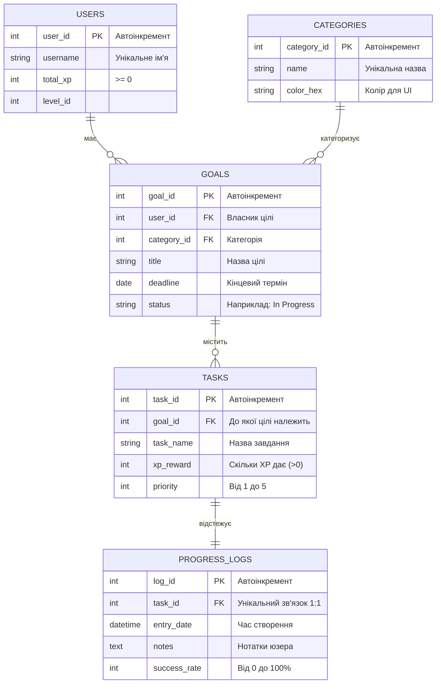

# Схема бази даних (Progress Hub API)

Цей документ описує структуру бази даних для нашого додатку. База побудована на реляційній моделі (MySQL) з використанням SQLAlchemy ORM.

## Візуальна ER-діаграма зв'язків

## Опис таблиць та зв'язків

1. **`users` (Користувачі)**
   Головна таблиця. Зберігає ім'я, рівень та загальну кількість заробленого досвіду (XP).
   *Зв'язок:* Один користувач може мати багато цілей (1:N до `goals`).

2. **`categories` (Категорії)**
   Довідник категорій (наприклад: Навчання, Спорт, Робота). Кожна має свій колір для відображення на фронтенді.
   *Зв'язок:* Одна категорія може застосовуватися до багатьох цілей (1:N до `goals`).

3. **`goals` (Цілі)**
   Глобальні плани користувача (наприклад: "Вивчити Python"). Мають дедлайн та статус виконання.
   *Зв'язок:* Одна ціль розбивається на багато завдань (1:N до `tasks`).

4. **`tasks` (Завдання)**
   Конкретні кроки для досягнення цілі. Мають пріоритет (1-5) та винагороду в XP.
   *Зв'язок:* Одне завдання має строго один запис про фінальний прогрес (1:1 до `progress_logs`).

5. **`progress_logs` (Логи прогресу)**
   Таблиця для збереження результату виконання конкретного завдання. Включає відсоток успіху (0-100%) та текстові нотатки.